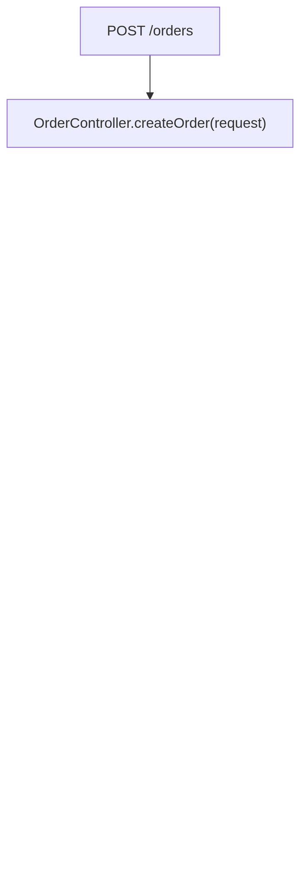
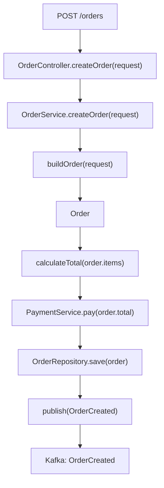

# code-execution-story


> A **[Hermes Agent](https://hermes-agent.nousresearch.com/docs)** skill that turns
> unfamiliar code into a **Mermaid execution-story diagram** — a navigable flow of how a
> program actually moves state from entry point to exit — instead of a flat,
> file-by-file summary.

Based on a prompt by **Kashish Sharma**, packaged as a reusable Hermes skill.



## Why

Most "explain this code" attempts die as a flat summary of files. This skill
reconstructs the **execution flow** and the **data lineage** — so you can answer:

- Where does execution start? What runs next?
- Where did this argument come from, and where does it go?
- Where is this value created, modified, passed, returned, consumed?
- What happens if this branch fails? Where does the request end?

It never invents flow: every hop is tagged `DEFINITELY CALLED` / `POSSIBLY CALLED` /
`INFERRED FROM FRAMEWORK` / `UNKNOWN`, and missing bodies show
`[implementation not provided]` rather than a hallucinated call graph.

## What you get

1. **Execution story** — 2–4 plain-language sentences.
2. **Mermaid flow** — one copy-pasteable diagram (the deliverable).
3. **Important data flows** — value lifecycles.
4. **Function map** — execution order + one-line role each.
5. **Key dependencies** — class / service / DB / queue / API edges.
6. **Things to investigate** — what the source did *not* reveal.

## Layout

```
SKILL.md                              # slim trigger + workflow + output contract
references/execution-story-prompt.md  # the full canonical prompt (all rules, examples)
references/repo-navigation.md         # how to slice a real repo into context cheaply
examples/                             # a worked example
```

## Install (Hermes)

```sh
git clone https://github.com/3rectangles/code-execution-story-skill.git /tmp/ces
mkdir -p ~/.hermes/skills/software-development/code-execution-story/references
cp -R /tmp/ces/. ~/.hermes/skills/software-development/code-execution-story/
rm -rf ~/.hermes/skills/software-development/code-execution-story/.git
```

Then in a session: `skill_view(name='code-execution-story')`.

## Usage

> "Use the code-execution-story skill on `OrderController.createOrder` in this repo."

Small prompt, big difference:

```
Trace OrderController.createOrder end to end. Show the call chain,
where each argument comes from, and the external boundaries.
Tag every hop by confidence.
```

## Worked example

**Input** (`examples/OrderController.java`, illustrative):

```java
@RestController
class OrderController {
    private final OrderService orderService;
    OrderController(OrderService s) { this.orderService = s; }

    @PostMapping("/orders")
    Order createOrder(@RequestBody CreateOrderRequest request) {
        return orderService.createOrder(request);
    }
}
```

**Output** — a single Mermaid diagram you can paste into
[Mermaid Live](https://mermaid.live):



…plus the execution story, data lineage, function map, and the list of things the
source *didn't* reveal (which is often the most useful part).

## Design rules the skill enforces

- **One entry point per diagram.** A whole service becomes a spider web.
- **Ground every hop.** Re-read `file:line` before shipping; downgrade anything unconfirmed.
- **Separate external nodes.** DB, queue, and third-party APIs are boundaries, not calls.
- **Async is explicit.** Kafka producers/consumers are bridged through a topic node.
- **Mermaid-safe output.** Quoted labels, simple ids, no viewer-breaking syntax.

Full rules: [`references/execution-story-prompt.md`](references/execution-story-prompt.md).

## License

MIT — see [LICENSE](LICENSE).
